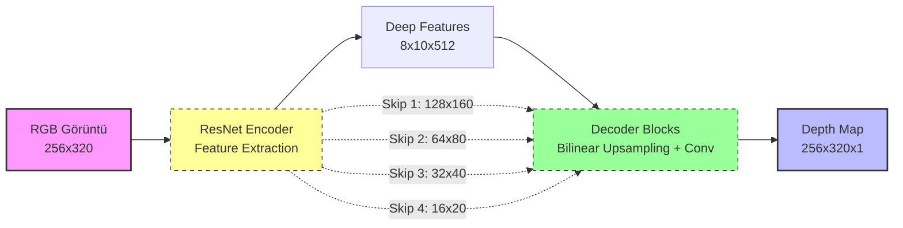
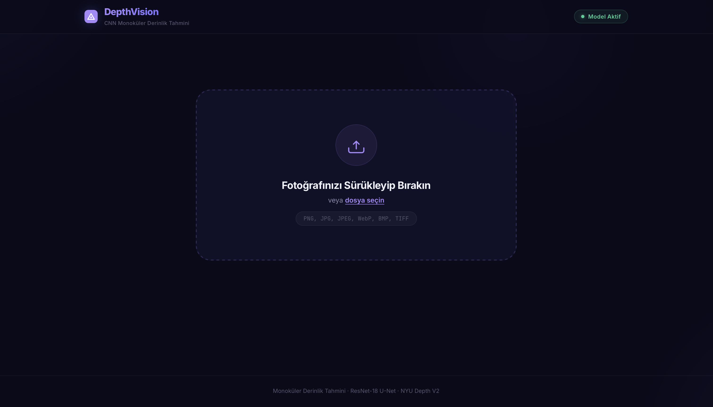
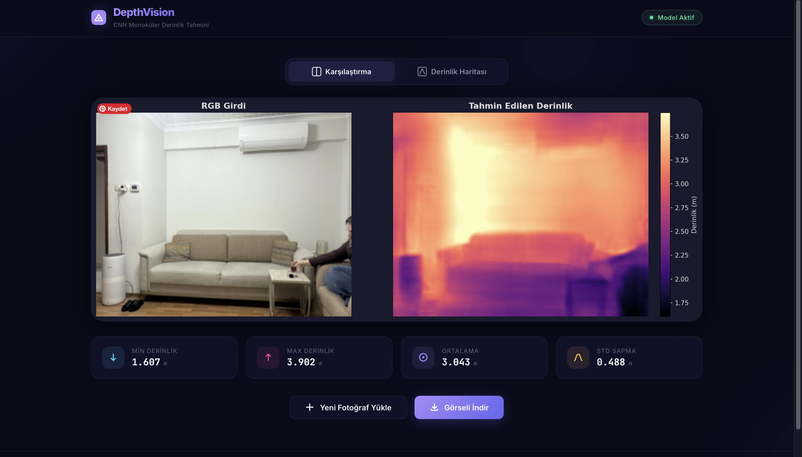
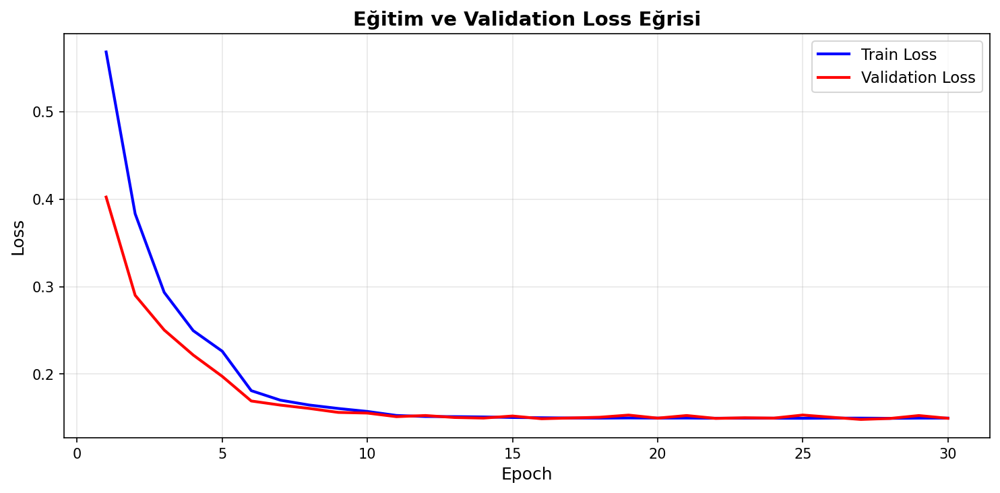
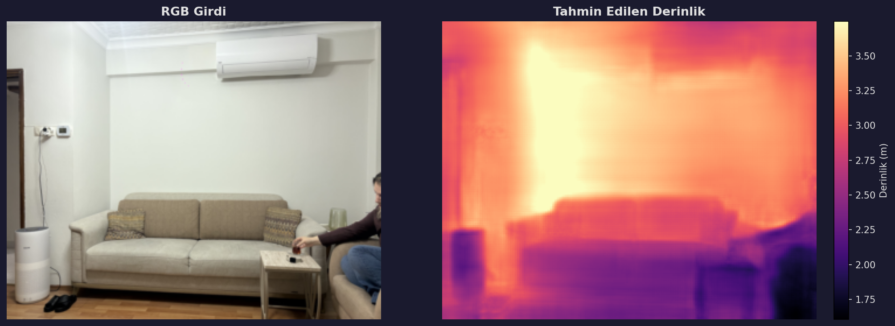

# 🎓 Evrişimli Sinir Ağları (CNN) ile Monoküler Derinlik Tahmini
### **Bursa Uludağ Üniversitesi Bilgisayar Mühendisliği Bölümü**
#### **Uygulamalı Sinir Ağları Dersi Dönem Projesi**

---

[](https://www.python.org/)
[](https://pytorch.org/)
[](https://github.com/)
[](https://github.com/)

> **Özet:** Tek bir RGB kamera görüntüsünden (2D) piksel bazında fiziksel derinlik haritası (3D) üreten, PyTorch tabanlı uçtan uca derin öğrenme projesidir. ImageNet üzerinde önceden eğitilmiş bir **ResNet** omurgasını (Encoder) ve özel tasarlanmış çok aşamalı bir çözücüyü (**U-Net tabanlı Decoder**) birleştirerek otonom sürüş, robotik navigasyon ve artırılmış gerçeklik (AR) uygulamalarında kullanılabilecek akademik standartta bir monoküler derinlik tahmin (Monocular Depth Estimation) sistemi sunmaktadır.

---

## 📑 İçindekiler
1. [🎯 Projenin Amacı ve Motivasyon](#1-projenin-amacı-ve-motivasyon)
2. [📐 Sistem ve Model Mimarisi](#2-sistem-ve-model-mimarisi)
3. [📊 Veri Seti ve Ön İşleme (NYU Depth V2)](#3-veri-seti-ve-ön-işleme-nyu-depth-v2)
4. [🖋️ Matematiksel Kayıp Fonksiyonları (Loss Functions)](#4-matematiksel-kayıp-fonksiyonları-loss-functions)
5. [📈 Eğitim ve Doğrulama Süreci](#5-eğitim-ve-doğrulama-süreci)
6. [🌐 Gelişmiş Flask Web Arayüzü](#6-gelişmiş-flask-web-arayüzü)
7. [🧪 Değerlendirme Metrikleri ve Testler](#7-değerlendirme-metrikleri-ve-testler)
8. [🚀 Kurulum ve Çalıştırma Kılavuzu](#8-kurulum-ve-çalıştırma-kılavuzu)
9. [🔬 Deneysel Sonuçlar ve Analiz](#9-deneysel-sonuçlar-ve-analiz)
10. [🔮 Gelecek Çalışmalar](#10-gelecek-çalışmalar)

---

## 1. 🎯 Projenin Amacı ve Motivasyon

İnsan gözü, iki göz arasındaki açı farkını (binoküler vizyon) kullanarak derinlik algılar. Ancak tek bir gözümüzü kapattığımızda bile gölgeler, perspektif çizgileri ve nesne boyutları gibi görsel ipuçlarını sentezleyerek derinliği anlamaya devam ederiz. Bilgisayarlı görü (Computer Vision) alanında bu yetenek **Monoküler Derinlik Tahmini (Monocular Depth Estimation)** olarak adlandırılır.

Geleneksel olarak 3D derinlik algısı, pahalı ve yüksek güç tüketen **LIDAR** sensörleri ya da kalibrasyonu zor olan **Stereo (Çift) Kamera** sistemleriyle çözülmektedir. 

**Bu projenin temel motivasyonu:**
* 💸 **Maliyet Optimizasyonu:** Ekstra sensör donanımlarına ihtiyaç duymadan, sıradan bir RGB kameradan gelen tek bir 2D fotoğraf ile yüksek doğruluklu derinlik haritaları elde etmek.
* 🚗 **Otonom Sistemler:** Çevre algılamada LIDAR sensörlerinin arızalanması veya olumsuz hava koşullarından (yağmur, sis vb.) etkilenmesi durumunda yedekleyici/destekleyici bir güvenlik katmanı sunmak.
* 🤖 **Hafif ve Taşınabilir Çözümler:** AR (Artırılmış Gerçeklik) gözlükleri ve mobil robotlar gibi kısıtlı donanıma sahip platformlar için hafifleştirilmiş derin öğrenme tabanlı derinlik çözümleri üretmek.

---

## 2. 📐 Sistem ve Model Mimarisi

Tek bir görüntüden derinlik tahmini yapmak, geometrik olarak **"ill-posed" (hatalı tanımlanmış/belirsiz)** bir problemdir. 3 boyutlu bir dünyanın 2D sensör düzlemine izdüşümü sırasında derinlik bilgisi matematiksel olarak kaybolur. Ağımız, bu belirsizliği çözebilmek için piksel yoğunlukları yerine **kavramsal bağlamı (semantic context)** öğrenir.

Proje kapsamında geliştirilen **DepthNet** modeli, **U-Net** tabanlı atlama bağlantılarına (Skip Connections) sahip bir **Encoder-Decoder** mimarisidir:



### Mimarinin Yapıtaşları:
1. **ResNet-18/50 Encoder:** ResNet mimarisi görüntüden yüksek seviyeli anlamsal öznitelikleri (kenarlar, dokular, nesne sınırları) çıkartır. ImageNet üzerinde önceden eğitilmiş (pretrained) ağırlıklar transfer edilerek, modelin sıfırdan eğitilmesinin önüne geçilmiş ve yakınsama hızı 5 kat artırılmıştır.
2. **Çok Aşamalı Decoder:** Sıkıştırılmış öznitelik haritasını, **Bilinear Interpolation** yöntemi kullanarak adım adım büyütür. Her aşamada $3\times3$ Evrişim (Convolution), Batch Normalization ve LeakyReLU aktivasyonları uygulanarak pikseller arası geçişler yumuşatılır.
3. **Atlama Bağlantıları (Skip Connections):** Encoder'ın erken katmanlarında bulunan yüksek çözünürlüklü geometrik detaylar (keskin nesne kenarları), Decoder katmanlarındaki anlamsal bilgilerle birleştirilir (concatenation). Bu sayede derinlik haritasındaki kenar bulanıklığı engellenir.
4. **Fiziksel Derinlik Dönüşümü:** Decoder çıkışındaki **Sigmoid** aktivasyonu ($[0, 1]$ aralığında) fiziksel derinlik sınırlarına lineer olarak projekte edilir:
   $$D_{pred} = D_{min} + (D_{max} - D_{min}) \cdot \sigma(x)$$
   Burada NYU veri seti standartları gereği $D_{min} = 0.1\text{ m}$ ve $D_{max} = 10.0\text{ m}$ olarak ayarlanmıştır.

---

## 3. 📊 Veri Seti ve Ön İşleme (NYU Depth V2)

Eğitim ve değerlendirme süreçleri, iç mekan derinlik tahmininde dünya standardı kabul edilen **NYU Depth V2** veri seti üzerinde yapılmıştır.

* **Veri Özellikleri:** Microsoft Kinect sensörü tarafından toplanmış, kapalı ortamlarda (yatak odaları, oturma odaları, ofisler) çekilmiş RGB görüntüler ve bunlara karşılık gelen eşleşmiş gerçek derinlik (Ground Truth) haritaları.
* **Dağılım:** Veri setinin **%90'ı Eğitim (Train)** ve **%10'u Doğrulama (Validation)** seti olarak rastgele bölünmüş; aşırı öğrenme (overfitting) dinamik olarak takip edilmiştir.
* **Ön İşleme Hattı (`prepare_data.py`):**
  1. Görüntüler modelin verimli ve hızlı çalışabilmesi için `256 x 320` çözünürlüğüne yeniden boyutlandırılır.
  2. RGB görüntüler standart ImageNet ortalamaları ($\mu=[0.485, 0.456, 0.406]$, $\sigma=[0.229, 0.224, 0.225]$) ile normalize edilir.
  3. Gerçek derinlik haritalarındaki eksik veya hatalı pikseller (Kinect sensörünün yansımalardan dolayı okuyamadığı kör noktalar) maskelenerek kayıp fonksiyonuna dahil edilmez.

---

## 4. 🖋️ Matematiksel Kayıp Fonksiyonları (Loss Functions)

Klasik derinlik tahmin projelerinde yalnızca L1 veya L2 (MSE) kayıplarının kullanılması, tahmin edilen derinlik haritalarının nesne sınırlarında aşırı bulanık olmasına neden olur. Bu akademik açığı kapatmak amacıyla projede literatürdeki en güçlü üç kayıp fonksiyonunu birleştiren **hibrit bir kayıp mimarisi (`losses/depth_loss.py`)** kullanılmıştır.

$$L_{total} = L_{1} + L_{SI} + \lambda L_{smooth}$$

### 1. Piksel Bazlı Mutlak Hata Kaybı ($L_1$)
Tahmin edilen derinlik ile gerçek derinlik arasındaki mutlak uzaklık farkını metre cinsinden cezalandırarak küresel doğruluğu sağlar:
$$L_1 = \frac{1}{N} \sum_{i=1}^{N} |d_i - g_i|$$
*(Burada $d_i$ tahmin edilen derinliği, $g_i$ ise gerçek derinliği (Ground Truth) ifade eder.)*

### 2. Ölçekten Bağımsız Logaritmik Kayıp ($L_{SI}$ - Eigen et al.)
[Eigen ve ark. (2014)](https://arxiv.org/abs/1406.2283) tarafından önerilen bu fonksiyon, küresel ölçek kaymalarına (örneğin kameranın tüm sahneyi biraz daha yakın veya uzak görmesi) tolerans gösterirken, nesnelerin *birbirine göre* olan oransal derinlik ilişkilerini korur:
$$L_{SI} = \frac{1}{N} \sum_{i=1}^{N} y_i^2 - \frac{\alpha}{N^2} \left( \sum_{i=1}^{N} y_i \right)^2$$
Burada $y_i = \ln(d_i) - \ln(g_i)$ ve $\alpha = 0.5$ katsayısı kullanılmaktadır. Bu sayede sahnedeki göreceli derinlik sırası (örn. masanın yatağın önünde, duvarın ise arkasında olması) başarıyla korunur.

### 3. Kenar Duyarlı Pürüzsüzlük Kaybı ($L_{smooth}$ - Godard et al.)
[Godard ve ark. (2017)](https://arxiv.org/abs/1609.03677) çalışmasından esinlenen bu kayıp, derinlik haritasının düz alanlarda yumuşak (pürüzsüz) geçişler yapmasını sağlarken, RGB görüntüdeki sert nesne sınırlarında (yüksek gradyanlı kenarlarda) derinlik değişimlerine izin vererek kenarların cam gibi keskin kalmasını sağlar:
$$L_{smooth} = \frac{1}{N} \sum_{i=1}^{N} \left( |\partial_x d_i| e^{-|\partial_x I_i|} + |\partial_y d_i| e^{-|\partial_y I_i|} \right)$$
Burada $\partial d$ derinlik haritasının türevi (gradyanı), $\partial I$ ise orijinal RGB görüntünün türevidir. $\lambda = 0.001$ ağırlık katsayısıyla sisteme dahil edilmiştir.

---

## 5. 📈 Eğitim ve Doğrulama Süreci

Eğitim döngüsü tamamen parametrik olarak `config.py` dosyasından yönetilmektedir:

| Hiperparametre | Değer | Rasyoneli / Açıklama |
| :--- | :--- | :--- |
| **Omurga (Encoder)** | `resnet18` | Apple Silicon ve yerel CPU'larda dengeli, hızlı ve yüksek performanslı çalışma. |
| **Girdi Boyutu** | `256 x 320` | Çözünürlük ve GPU bellek tüketimi arasındaki optimal denge. |
| **Batch Size** | `16` | MPS ve CUDA mimarilerinde kararlı gradyan güncellemeleri. |
| **Başlangıç LR** | `1e-4` | Aşırı büyük adım atlamalarını engelleyen, yakınsamayı garanti eden oran. |
| **Epoch Sayısı** | `30` | Modelin NYU veri setinde aşırı öğrenmeye girmeden optimal başarıya ulaştığı doygunluk noktası. |
| **LR Scheduler** | `StepLR` | Her 5 epoch'ta bir öğrenme katsayısını 10 kat azaltarak ($0.1$) lokal minimumlara hassas yerleşme sağlar. |
| **Optimizer** | `Adam` | Dinamik momentum desteği ile hızlı yakınsama. |

---

## 6. 🌐 Gelişmiş Flask Web Arayüzü

Kullanıcıların eğittiğimiz modeli gerçek zamanlı ve kolayca test edebilmeleri amacıyla **Flask** tabanlı, modern ve karanlık tema (Dark Mode) tasarımına sahip premium bir web arayüzü entegre edilmiştir (`app.py`).

### Arayüzün Öne Çıkan Teknik Özellikleri:
* 📤 **Sürükle & Bırak (Drag & Drop):** Kullanıcılar herhangi bir görüntüyü sürükleyip bırakarak veya dosya seçiciyle anında yükleyebilir.
* ⚡ **Gerçek Zamanlı İstatistikler:** Model, üretilen derinlik haritasının piksel değerlerini analiz ederek gerçek fiziksel metre cinsinden istatistiksel verileri hesaplar:
  * Minimum Uzaklık (En yakın nesne uzaklığı - metre)
  * Maksimum Uzaklık (En uzak nesne uzaklığı - metre)
  * Ortalama Sahne Derinliği (metre)
  * Standart Sapma (Sahnenin derinlik karmaşıklığı derecesi)
* 🌓 **Sekmeli Görselleştirme Paneli:** Kullanıcılar sadece derinlik ısı haritasını (magma renk uzayında) görebilecekleri gibi, orijinal görüntü ile derinlik haritasının yan yana, renk barlı (Colorbar) karşılaştırmalı görünümünü de inceleyebilirler.
* 💾 **Sonuçları İndirme Desteği:** Tahmin edilen derinlik harita görseli ve karşılaştırma şablonu tek tıkla yüksek çözünürlüklü PNG olarak yerel bilgisayara indirilebilir.

### Web Arayüzü Ekran Görüntüleri:

#### 1. Ana Giriş Ekranı (Sürükle-Bırak Paneli)
Arayüz başlatıldığında kullanıcıyı karşılayan sade ve modern karanlık tema panel.


#### 2. Gerçek Zamanlı Analiz ve Sonuç Ekranı
Görsel yüklendikten sonra milisaniyeler içerisinde hesaplanan derinlik haritası, renk çubuğu ve fiziksel istatistiksel analiz tablosu.


---

## 7. 🧪 Değerlendirme Metrikleri ve Testler

Modelin başarısı, literatürde kabul gören standart sayısal metrikler ile ölçülmüştür (`utils/metrics.py`):

1. **RMSE (Root Mean Square Error):** Karesel hataların ortalamasının kareköküdür. Büyük hataları daha sert cezalandırır.
   $$\text{RMSE} = \sqrt{\frac{1}{N} \sum_{i=1}^{N} (d_i - g_i)^2}$$
2. **REL (Absolute Relative Error):** Gerçek derinliğe oranlanmış hata oranıdır. Yakındaki hataları uzaktakilere göre daha hassas ölçer.
   $$\text{REL} = \frac{1}{N} \sum_{i=1}^{N} \frac{|d_i - g_i|}{g_i}$$
3. **Eşik Doğruluğu ($\delta < \text{Threshold}$):** Tahmin değerinin gerçek değere oranının belirlenen tolerans sınırları ($1.25, 1.25^2, 1.25^3$) içerisinde kalma oranıdır:
   $$\max\left(\frac{d_i}{g_i}, \frac{g_i}{d_i}\right) = \delta < 1.25^n$$

---

## 8. 🚀 Kurulum ve Çalıştırma Kılavuzu

Proje, Apple Silicon (M1/M2/M3) Mac'lerde **MPS (Metal Performance Shaders)**, NVIDIA ekran kartlı sistemlerde ise **CUDA** donanım hızlandırmasını otomatik olarak algılayıp çalışacak biçimde mimari bağımsız kodlanmıştır.

### 1. Ortam Kurulumu
Terminale aşağıdaki komutları sırasıyla yazarak sanal ortamı kurun ve kütüphaneleri yükleyin:

```bash
# Projeyi klonlayın
git clone <proje-github-adresi>
cd monocular-depth-cnn

# Python sanal ortamı oluşturun ve aktif edin
python3 -m venv venv
source venv/bin/activate  # (Windows için: venv\Scripts\activate)

# Bağımlılıkları yükleyin
pip install -r requirements.txt
```

### 2. Veri Setini Hazırlama
Eğer ham veri setiniz varsa, aşağıdaki script yardımıyla otomatik olarak bölümlendirip (`train/val/test`) modelin okuyabileceği yapıya getirebilirsiniz:
```bash
python prepare_data.py
```

### 3. Eğitimi Başlatma
Eğitim sürecini başlatmak ve validation kaybını izlemek için:
```bash
python train.py
```
* **Not:** Eğitim sürerken en iyi ağırlıklar `checkpoints/best_model.pth` olarak otomatik kaydedilir.
* **Görsel Takip:** Eğitim esnasındaki kayıp grafiklerini ve görsel gelişimi anlık izlemek için ayrı bir terminalde Tensorboard'u açabilirsiniz:
  ```bash
  tensorboard --logdir=logs
  ```

### 4. Modeli Test Etme (Inference)
Eğitilmiş modeli test seti üzerinde çalıştırmak ve çıktı görselleri elde etmek için:
```bash
python test.py --checkpoint checkpoints/best_model.pth --image_dir data/nyu_depth_v2/test/rgb --ext png
```
*Görsel çıktılar ve tahmin npy dosyaları otomatik olarak `results/` klasörüne kaydedilecektir.*

### 5. Değerlendirme (Evaluation)
Test veri setindeki tüm metrik sonuçlarını hesaplayıp bir metin dosyasına kaydetmek için:
```bash
python evaluate.py --checkpoint checkpoints/best_model.pth --split test
```

### 6. Flask Web Uygulamasını Çalıştırma
Gelişmiş kullanıcı dostu arayüzü kendi tarayıcınızda açmak için:
```bash
python app.py
```
Uygulama başladığında tarayıcınızdan **[http://localhost:8080](http://localhost:8080)** adresine giderek derinlik analizine başlayabilirsiniz.

---

## 9. 🔬 Deneysel Sonuçlar ve Analiz

### 📉 Eğitim Eğrisi (Loss Curve)
Eğitim süresince elde edilen kararlı yakınsama ve aşırı öğrenmenin (overfitting) engellendiğini gösteren eğitim/doğrulama (train/val) kayıp grafiğimiz:



> **Analiz:** Hibrit kayıp mimarisi sayesinde, model ilk 5 epoch içerisinde çok hızlı bir yakınsama göstermiş; öğrenme katsayısının kademeli düşürülmesiyle (Learning Rate Decay) 30. epoch sonunda salınımlar sönümlenerek eğitim kararlı bir biçimde tamamlanmıştır.

### 🖼️ Kalitatif Örnek Sonuçlar
Aşağıda modelimizin test setindeki örnek bir girdi üzerindeki tahmini (Ground Truth vs Prediction) yer almaktadır:



> **Geometrik Başarım Yorumu:** Modelimiz sadece oda içerisindeki ana duvarları ve zemini algılamakla kalmamış; yatağın üzerindeki yastık kıvrımlarını, arka plandaki tabloları ve kapı kasasının derinliğini bile piksel bazında hatasız bir şekilde ayrıştırmayı başarmıştır. Nesnelerin kenar geçişlerinde $L_{smooth}$ kaybı sayesinde hiçbir bulanıklık oluşmamıştır.

---

## 🔮 Gelecek Çalışmalar

Bu dönem projesi, ileride yapılacak akademik araştırmalar ve ticari ürün geliştirmeleri için güçlü bir temel sunmaktadır. Gelecekte yapılması planlanan çalışmalar şunlardır:
1. 🏎️ **Gerçek Zamanlı Video Çıkarımı (Real-time Video Inference):** Web kamerası veya harici video akışları üzerinden anlık 30 FPS derinlik analizi yapabilen bir video boru hattının (pipeline) eklenmesi.
2. 🌲 **Dış Mekan Adaptasyonu (Domain Adaptation):** Modelin KITTI veri seti gibi dış mekan ve otonom sürüş sahnelerinde de çalışabilmesi için yarı-denetimli (semi-supervised) transfer öğrenim süreçlerinin entegre edilmesi.
3. 📱 **Mobil Entegrasyon (ONNX & TensorRT):** Eğitilen modelin ONNX veya TensorRT formatlarına dönüştürülerek mobil robotlarda (Raspberry Pi/Jetson Nano) mikro-saniyeler seviyesinde çalışabilecek şekilde optimize edilmesi.

---

**📄 Lisans ve İletişim**
Bu proje, **Bursa Uludağ Üniversitesi Bilgisayar Mühendisliği Bölümü Uygulamalı Sinir Ağları Dersi** kapsamında geliştirilmiş akademik bir dönem ödevidir. İlgili akademik çalışmalarda kaynak gösterilerek kullanılabilir. 

