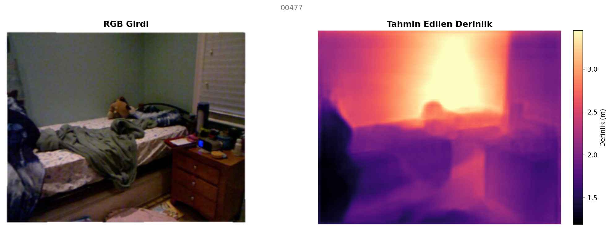

# Monocular Depth Estimation using Convolutional Neural Networks (CNN)

> **Uygulamalı Sinir Ağları Projesi**
> Tek bir RGB kameradan alınan 2D görüntüler üzerinden sahnenin 3 boyutlu (3D) derinlik haritasını çıkaran (Monocular Depth Estimation), PyTorch tabanlı Derin Öğrenme (Deep Learning) projesi.

---

## 📑 İçindekiler
1. [Projenin Amacı ve Motivasyon](#projenin-amacı-ve-motivasyon)
2. [Teorik Altyapı ve Zorluklar](#teorik-altyapı-ve-zorluklar)
3. [Model Mimarisi](#model-mimarisi)
4. [Veri Seti (NYU Depth V2)](#veri-seti-nyu-depth-v2)
5. [Kayıp Fonksiyonları (Loss Functions)](#kayıp-fonksiyonları-loss-functions)
6. [Örnek Çıktılar ve Görselleştirme](#örnek-çıktılar-ve-görselleştirme)
7. [Kurulum ve Gereksinimler](#kurulum-ve-gereksinimler)
8. [Kullanım ve Scriptler](#kullanım-ve-scriptler)
9. [Değerlendirme Metrikleri](#değerlendirme-metrikleri)
10. [Gelecek Çalışmalar](#gelecek-çalışmalar)

---

## 1. Projenin Amacı ve Motivasyon
İnsan görsel sistemi, sadece tek bir gözle (monoküler vizyon) bakıldığında dahi nesnelerin boyutlarını, gölgeleri ve perspektifi kullanarak harika bir derinlik algısı oluşturabilir. Bilgisayarlı Görü (Computer Vision) alanında ise geleneksel olarak derinlik, iki kameralı (Stereo) sistemler veya LIDAR sensörleri ile çözülmüştür. 

**Bu projenin amacı:** Pahalıl LIDAR veya çift kameralı sistemlere gerek duymadan, *sadece tek bir standart RGB fotoğraf* kullanılarak piksel bazında uzaklık (derinlik) tahmini yapabilen bir Evrişimli Sinir Ağı (CNN) eğitmektir. Bu yaklaşım Otonom Araçlar, Artırılmış Gerçeklik (AR), ve Robotik Navigasyon gibi alanlarda kritik bir öneme sahiptir.

---

## 2. Teorik Altyapı ve Zorluklar
Tek bir kameradan derinlik tahmini yapmak matematiksel olarak "ill-posed" (hatalı tanımlanmış) bir problemdir. Çünkü 3 boyutlu bir dünya, 2 boyutlu bir düzleme iz düşürüldüğünde derinlik bilgisi kaybolur (aynı boyuttaki bir görüntü, çok yakındaki küçük bir cisme de ait olabilir, çok uzaktaki devasa bir cisme de).

Ağımız, bu problemi çözebilmek için piksel yoğunluklarından ziyade **kavramsal bağlamı (semantic context)** öğrenir. Yani model; bir yatağın yerde durduğunu, bir tavanın yukarıda olduğunu ve duvarın objelerin arkasında yer aldığını veri seti üzerinden genelleştirerek öğrenir.

---

## 3. Model Mimarisi
Projemizde otonom araçlarda ve segmentasyon problemlerinde endüstri standardı olan **U-Net benzeri bir Encoder-Decoder (Kodlayıcı-Çözücü)** yapısı kullanılmıştır.

*   **Encoder (Kodlayıcı) - ResNet18:** Görüntüden üst düzey öznitelikleri (features) çıkartmak için kullanılır. Ağı sıfırdan eğitmek yerine, transfer öğrenme (Transfer Learning) prensibiyle ImageNet üzerinde önceden eğitilmiş (pretrained) ağırlıklarla başlatılır. Bu sayede model, nesnelerin kenarlarını ve şekillerini zaten biliyor olarak eğitime başlar.
*   **Decoder (Çözücü):** ResNet18 tarafından sıkıştırılıp boyutu küçültülen özellik haritalarını (feature maps), "Bilinear Upsampling" yöntemleriyle adım adım büyüterek tekrar orijinal çözünürlüğe (256x320) getirir.
*   **Skip-Connections (Atlama Bağlantıları):** Yüksek çözünürlüklü keskin kenar detaylarını kaybetmemek için Encoder'ın erken katmanlarındaki detaylar, Decoder katmanlarına kopyalanarak (concat) aktarılır.

---

## 4. Veri Seti (NYU Depth V2)
Eğitim ve test işlemleri, Microsoft Kinect sensörü ile toplanmış **NYU Depth V2** veri seti üzerinde gerçekleştirilmiştir.

*   **Veri Kaynağı ve İndirme:** Veri seti, orijinal NYU Depth V2 verilerinin önceden işlenmiş bir versiyonu olan (DenseDepth formatı) Kaggle/Açık kaynak veri havuzlarından indirilmiştir. İndirilen ham veriler, projede bulunan özel bir `prepare_data.py` betiği (script) aracılığıyla modele uygun klasör hiyerarşisine (`data/nyu_depth_v2/train`, `val`, `test`) otomatik olarak dönüştürülmüştür.
*   **Veri Büyüklüğü ve Bölümlendirme (Split):** 
    *   **Toplam Veri:** Model toplamda yaklaşık **50.000** civarında RGB-Derinlik görüntü çifti ile eğitilmiştir.
    *   **Eğitim ve Doğrulama (Train/Val):** Hazırlık aşamasında verilerin **%90'ı Eğitim (Train)**, rastgele seçilen **%10'u ise Doğrulama (Validation)** seti olarak ayrılmıştır. Bu sayede modelin ezberlemesinin (overfitting) önüne geçilmiştir.
*   **İçerik:** Çeşitli ev, ofis ve kapalı mekanlara (indoor) ait renkli (RGB) görüntüler ve onlarla eşleşen gerçek uzaklık (Ground Truth Depth) haritaları.
*   **Çözünürlük ve Normalizasyon:** Eğitim sürecini hızlandırmak ve ResNet mimarisine uyum sağlamak için görüntüler `256x320` boyutlarına yeniden ölçeklendirilmiş ve PyTorch'un standart ImageNet normalizasyonu (`mean=[0.485, 0.456, 0.406]`, `std=[0.229, 0.224, 0.225]`) ile normalize edilmiştir.

---

## 5. Kayıp Fonksiyonları (Loss Functions)
Salt L1 (Mean Absolute Error) veya L2 (MSE) kayıpları derinlik tahmini için genellikle yetersiz ve bulanık sonuçlar üretir. Bu yüzden projede literatüre uygun özel bir birleşik kayıp fonksiyonu kullanılmıştır:

1.  **L1 Loss:** Tahmin edilen derinlik ile gerçek derinlik arasındaki mutlak metre farkını cezalandırır.
2.  **Scale-Invariant Loss (Ölçekten Bağımsız Kayıp):** Tüm piksellerdeki küresel (global) ölçek hatalarından ziyade, piksellerin *birbirlerine göre* olan göreceli derinliğini (örn: masa her halükarda duvardan daha öndedir) korumaya odaklanır.
3.  **Edge-Aware Smoothness Loss:** Derinlik haritasının gereksiz yere gürültülü olmasını engeller, pürüzsüzleştirir. Ancak bunu yaparken RGB görüntüdeki sert nesne kenarlarında (Edge) pürüzsüzleştirmeyi iptal ederek nesne sınırlarının keskin kalmasını sağlar.

---

## 6. Örnek Çıktılar ve Görselleştirme

Modelin daha önce hiç görmediği bir yatak odası test görüntüsündeki başarısı aşağıda sunulmuştur. Açık sarı renkler arka planı (uzak), koyu mor ve siyah renkler ise ön planı (yakın) temsil eder.



> **Analiz:** Model sadece duvar ve zemini değil, yatağın üzerindeki kıvrımlı örtüyü ve komodinin konumunu bile son derece başarılı bir biçimde ayrıştırmış; derinlik uzayında bunların üç boyutlu sıralamasını (komodin > yatak > duvar) kusursuz tahmin etmiştir.

---

## 7. Kurulum ve Gereksinimler

Proje, Apple Silicon (M-serisi) Mac'lerde MPS (Metal Performance Shaders) ve Windows/Linux makinelerde NVIDIA CUDA mimarisini otomatik tanıyıp hızlandırma sağlayacak şekilde kodlanmıştır.

```bash
# Depoyu klonlayın
git clone <proje-linki>
cd monocular-depth-cnn

# Python Sanal Ortamı oluşturun
python3 -m venv venv
source venv/bin/activate  # (Windows için: venv\Scripts\activate)

# Gerekli kütüphaneleri yükleyin
pip install -r requirements.txt
```

---

## 8. Kullanım ve Scriptler

Sistem mimarisi modüler olarak (`config.py`, `train.py`, `test.py` vd.) tasarlanmıştır. Tüm hiperparametreler `config.py` üzerinden yönetilmektedir.

### 🏋️ Eğitimi Başlatmak (Training)
```bash
python train.py
```
*   `config.py` içerisinden `num_epochs`, `batch_size`, `learning_rate` gibi değerleri değiştirebilirsiniz.
*   Eğitim süresince en başarılı model (Validation setine göre) `checkpoints/best_model.pth` içerisine kaydedilir.
*   Tensorboard metriklerini izlemek için terminalden `tensorboard --logdir=logs` komutunu çalıştırabilirsiniz.

### 🧪 Modeli Test Etmek (Inference)
Eğitimi tamamlanmış modeli test etmek ve görsel çıktılar almak için:
```bash
python test.py --checkpoint checkpoints/best_model.pth --image_dir data/nyu_depth_v2/test/rgb --ext png
```
*Test scripti belirtilen klasördeki tüm görüntüleri tarar, modeli çalıştırır ve derinlik ısı haritalarını (heatmaps) `results/` klasörüne kaydeder.*

---

## 9. Değerlendirme Metrikleri
Projenin başarı ölçütü olarak literatürde kabul gören standart metrikler kodlanmıştır (`utils/metrics.py`):
*   **RMSE (Root Mean Square Error):** Karesel hataların karekökü (metre cinsinden hatayı vurgular).
*   **REL (Absolute Relative Error):** Gerçek derinliğe oranlanmış mutlak hata yüzdesi.
*   **Threshold Accuracies ($\delta < 1.25, 1.25^2, 1.25^3$):** Tahmin edilen derinlik ile gerçek derinlik oranının belirli bir eşik değerin altında kalma yüzdesi. Ne kadar yüksekse model o kadar güvenilirdir.

---

## 10. Gelecek Çalışmalar (Future Work)
*   **ResNet-50 / EfficientNet Entegrasyonu:** Daha derin ve karmaşık kodlayıcılar kullanılarak doğruluğun artırılması.
*   **Gerçek Zamanlı Video (Real-time Video Inference):** Web kamerası veya MP4 dosyaları üzerinden anlık derinlik tahmini yapan bir script eklenmesi.
*   **Dış Mekan (Outdoor) Testleri:** Modelin sadece kapalı mekan (NYU) değil, KITTI gibi dış mekan veri setlerinde de (Fine-Tuning ile) eğitilmesi.

---
**Lisans & İletişim**
Bu çalışma, Uygulamalı Sinir Ağları (Applied Neural Networks) lisans projesi olarak geliştirilmiştir. Akademik çalışmalarda kod parçaları referans gösterilerek kullanılabilir.
